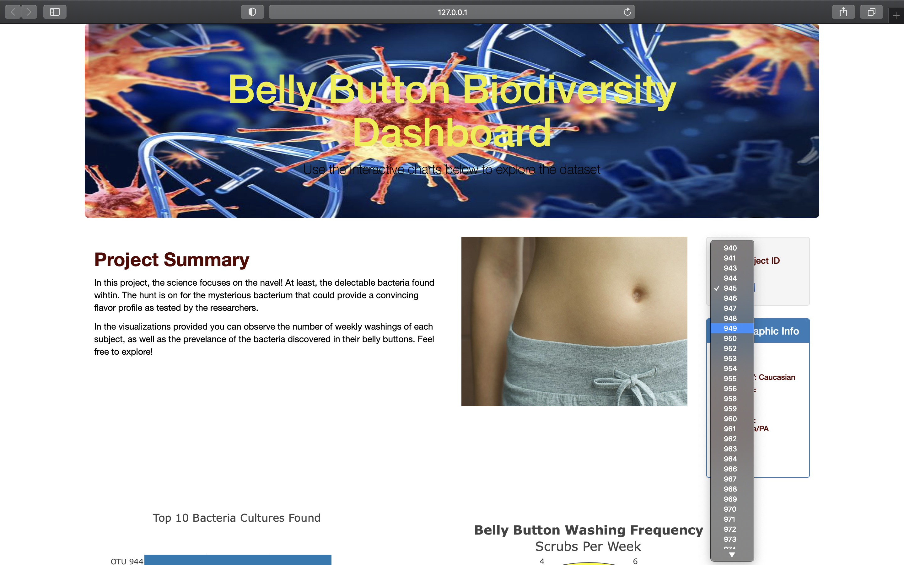
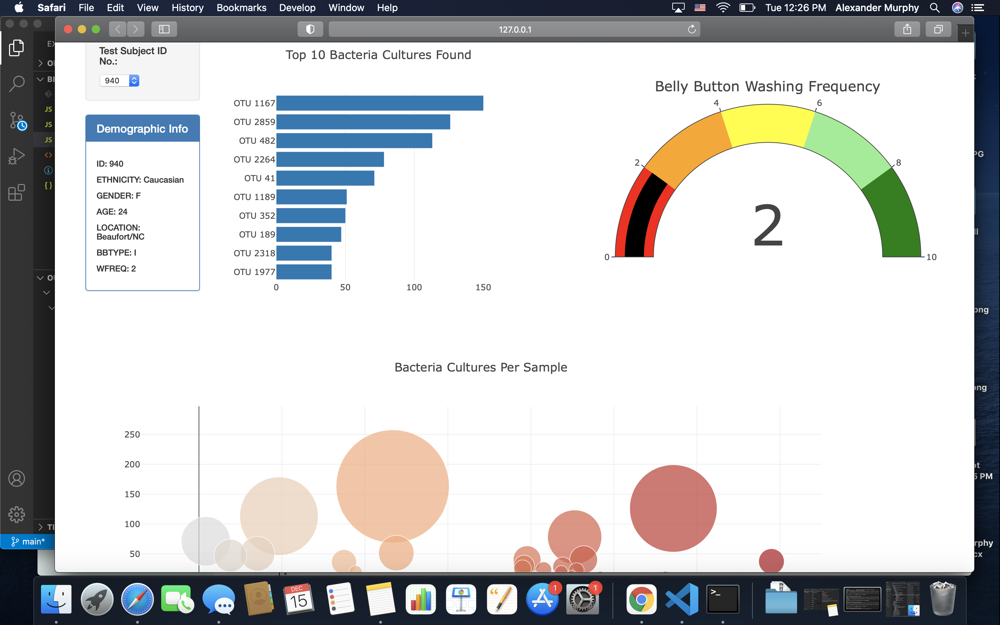

# Biodiversity_Analysis
This project consisted of using JavaScript to create and fill a page from a JSON sample set of data and perform basic analyses and visualizations.  

## Next steps:
- Explore hosting site like Heroku to host the scripts remotely rather than limited local server
- Combine with FLASK, or similar packages to allow scraping for data rather than static data sets

    
    

